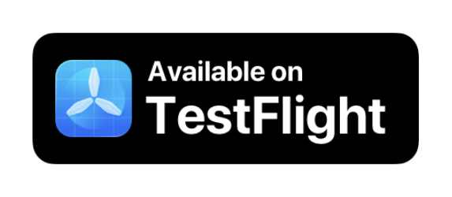

# Goodtime

**一款极简但功能强大的生产力计时器，专为保持专注、远离干扰而设计。**

[官网](https://goodtime.tools/)

## 特性

### 生产力模式

- 🍅 **番茄钟计时器**：结构化的专注会话后跟短暂休息，保持头脑清醒。提升学习效率。
- ☕ **长休息**：在几个番茄钟会话后进行更长的休息，充分充电，保持高生产力水平。
- ⏳ **累计流动计时器**：跟踪您的连续时间，进入心流状态时累积休息预算。准备好时再休息。

### 控制与时间追踪

- **可配置计时器**：匹配您偏好的工作流程。直观的滑动手势暂停、跳过或增加额外时间。
- **极简设计**：简洁界面帮助您专注，无干扰。
- **详细统计**：追踪累计专注时间，量化您的生产力。设置每日提醒，自定义一天/一周的开始时间。
- **专注保护**：在学习会话期间使用勿扰模式。

### 高级功能

- **标签与自定义**：分配彩色标签、归档，完全自定义计时器显示。
- **专业统计**：基于标签的可视化、手动会话编辑和笔记。
- **备份与导出**：保持数据安全且可移植。
- **高级提醒**：屏幕闪烁、手电筒和持久通知。

## 下载

## 核心优势

🧠 **实现专注 & 提升生产力** - 简单、私密、开源。

Goodtime 是一款独立开源的极简生产力计时器 - 轻量级、无广告、无追踪。

非常适合：
- 需要学习计时器的学生
- 追求深度工作和时间管理的专业人士
- 与干扰和拖延作斗争的任何人

## 常见问题

### Android 系统杀死 Goodtime 怎么办？

不同手机厂商（OEM）对依赖后台工作和闹钟的应用采取激进的电池优化策略。

建议禁用此应用的电池优化以获得准确的闹钟。

最坏情况下，如果仍有问题，尝试保持手机充电和/或工作时屏幕常亮。

详情请参阅 [www.dontkillmyapp.com](https://dontkillmyapp.com/)

## 技术特点

- **跨平台**：支持 Android 和 iOS
- **Kotlin Multiplatform**：现代化技术栈
- **离线使用**：无需网络连接
- **开源**：完全透明的代码

## 适用场景

- **学习**：番茄工作法提高学习效率
- **工作**：深度工作时间段管理
- **冥想**：定时冥想练习
- **健身**：运动间歇计时
- **阅读**：专注阅读时间管理

## 许可证

本项目采用开源许可证发布，详见 COPYING.md。
